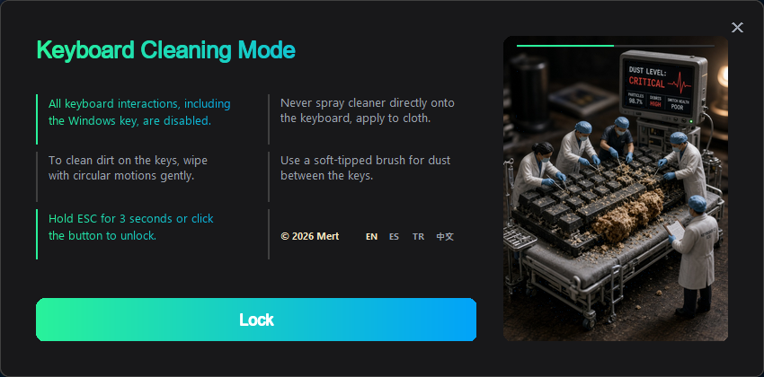
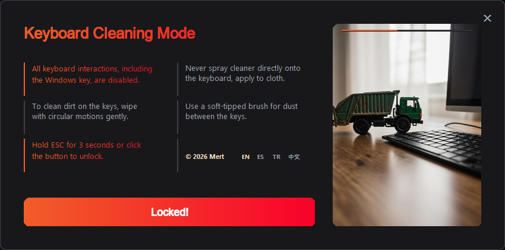

# Keyboard Cleaning Mode

A lightweight desktop application that locks your keyboard to safely clean it without accidental keystrokes.

## Preview

## Features
- Locks all keyboard inputs instantly.
- Prevents accidental typing or shortcut activation while wiping keys.
- Simple and easy-to-use interface with multi-language support.

## How to Use
1. Go to the **Releases** section on the right side of this repository.
2. Download the latest `Keyboard.Cleaning.Mode.exe` file.
3. Run the application whenever you need to clean your keyboard!

## Note
Depending on your keyboard model, dedicated hardware media keys or volume wheels managed by proprietary manufacturer software may still function while the cleaning mode is active.
